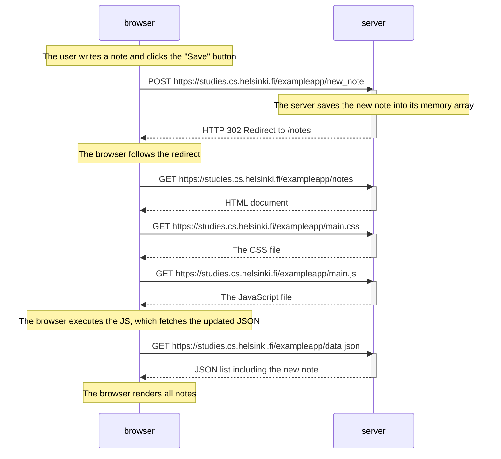
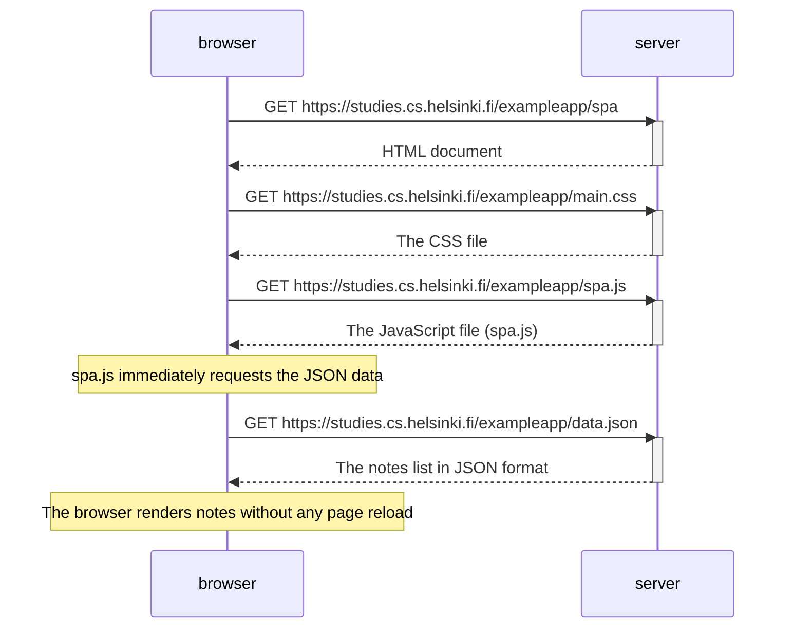
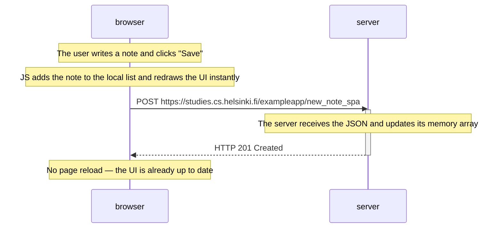

# Part 0 Exercises - Full Stack Open

## Exercise 0.4: New note diagram (Traditional Web App)

```mermaid
sequenceDiagram
    participant browser
    participant server

    Note over browser: The user writes a note and clicks the "Save" button

    browser->>server: POST https://studies.cs.helsinki.fi/exampleapp/new_note
    activate server
    Note over server: The server saves the new note into its memory array
    server-->>browser: HTTP 302 Redirect to /notes
    deactivate server

    Note over browser: The browser follows the redirect

    browser->>server: GET https://studies.cs.helsinki.fi/exampleapp/notes
    activate server
    server-->>browser: HTML document
    deactivate server

    browser->>server: GET https://studies.cs.helsinki.fi/exampleapp/main.css
    activate server
    server-->>browser: The CSS file
    deactivate server

    browser->>server: GET https://studies.cs.helsinki.fi/exampleapp/main.js
    activate server
    server-->>browser: The JavaScript file
    deactivate server

    Note over browser: The browser executes the JS, which fetches the updated JSON

    browser->>server: GET https://studies.cs.helsinki.fi/exampleapp/data.json
    activate server
    server-->>browser: JSON list including the new note
    deactivate server

    Note over browser: The browser renders all notes
```

## Exercise 0.5: Single page app diagram

```mermaid
sequenceDiagram
    participant browser
    participant server

    browser->>server: GET https://studies.cs.helsinki.fi/exampleapp/spa
    activate server
    server-->>browser: HTML document
    deactivate server

    browser->>server: GET https://studies.cs.helsinki.fi/exampleapp/main.css
    activate server
    server-->>browser: The CSS file
    deactivate server

    browser->>server: GET https://studies.cs.helsinki.fi/exampleapp/spa.js
    activate server
    server-->>browser: The JavaScript file (spa.js)
    deactivate server

    Note over browser: spa.js immediately requests the JSON data

    browser->>server: GET https://studies.cs.helsinki.fi/exampleapp/data.json
    activate server
    server-->>browser: The notes list in JSON format
    deactivate server

    Note over browser: The browser renders notes without any page reload
```

## Exercise 0.6: New note in Single page app diagram

```mermaid
sequenceDiagram
    participant browser
    participant server

    Note over browser: The user writes a note and clicks "Save"
    Note over browser: JS adds the note to the local list and redraws the UI instantly

    browser->>server: POST https://studies.cs.helsinki.fi/exampleapp/new_note_spa
    activate server
    Note over server: The server receives the JSON and updates its memory array
    server-->>browser: HTTP 201 Created
    deactivate server

    Note over browser: No page reload — the UI is already up to date
```